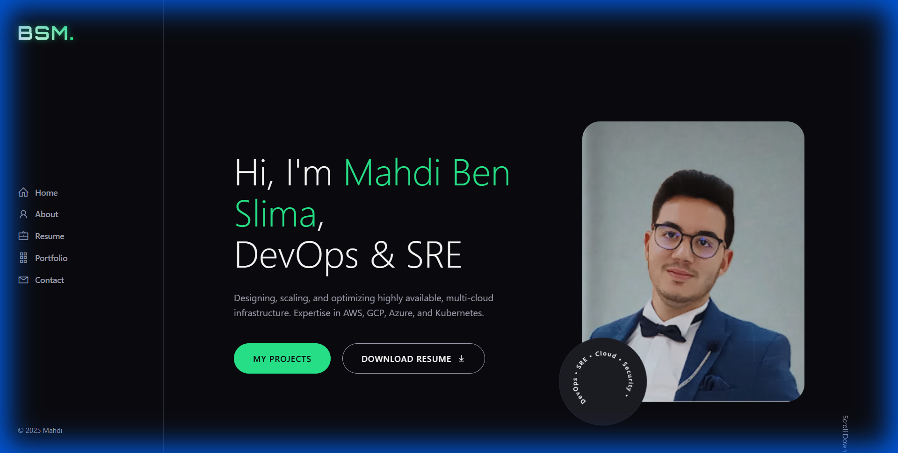
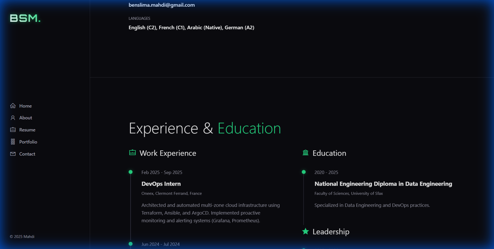
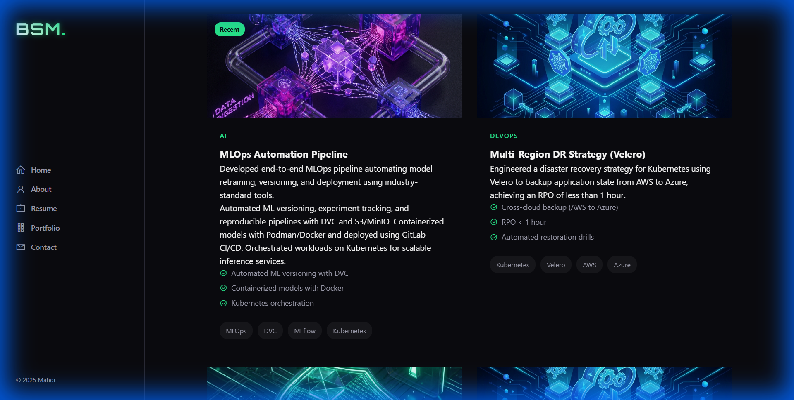
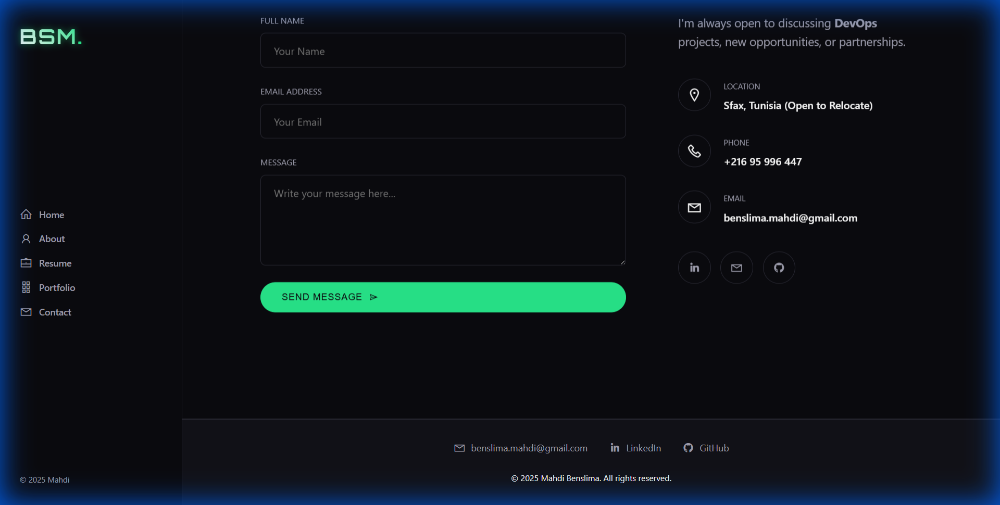

# My Personal Portfolio



A modern, responsive personal portfolio website built with **React** and **Vite**, featuring a dynamic project showcase and resume section.

---

## 🚀 Technologies Used

This project leverages the following technologies:

| Category | Technology | Description |
| :--- | :--- | :--- |
| **Frontend Framework** |  | Dynamic UI and Component-based architecture. |
| **Build Tool** |  | Fast development server and optimized build process. |
| **Styling** |  | Custom responsive styling with CSS Variables. |
| **Icons** |  | Used for interface icons (Line Awesome). |

---

## 📂 Project Structure

```
portfolio/
├── public/
│   ├── images/          # Project images and assets
│   └── vite.svg         # Favicon
├── src/
│   ├── assets/          # Component-specific assets
│   ├── components/      # React functional components
│   │   ├── Layout/      # Layout wrappers
│   │   └── Sections/    # Page sections (Portfolio, Resume, etc.)
│   ├── data/            # JSON Data files (Content is here!)
│   ├── App.jsx          # Main App component
│   └── main.jsx         # Entry point
├── docs/                # Documentation assets
└── package.json         # Dependencies and scripts
```

---

## 🛠️ Installation & Build Process

### Prerequisites
- Node.js (v18+ recommended)
- npm or yarn

### 1. Clone the repository
```bash
git clone https://github.com/benslimamahdi/benslimamahdi.github.io.git
cd portfolio
```

### 2. Install Dependencies
```bash
npm install
```

### 3. Run Development Server
Start the local development server with hot-reload:
```bash
npm run dev
```
Access the app at `http://localhost:5173`.

### 4. Build for Production
Create an optimized production build:
```bash
npm run build
```
The output will be in the `dist/` directory.

---

## 📝 Content Management (How to Edit)

This portfolio is designed to be easily updatable **without writing code**. Data is separated into JSON files in `src/data/`.

### 1. Adding a New Project

1.  **Add Image**: Place your project screenshot in `public/images/`.
2.  **Edit Data**: Open `src/data/projects.json`.
3.  **Add Entry**: Add a new object to the array:

```json
{
    "id": 99,
    "title": "New Awesome Project",
    "category": "DevOps",
    "image": "/images/your-image.png", 
    "description": "Short description of the project.",
    "details": "Longer details...",
    "keyAchievements": [
        "Achievement 1",
        "Achievement 2"
    ],
    "techStack": ["React", "AWS", "Docker"],
    "githubLink": "https://github.com/yourusername/project",
    "isRecent": true
}
```

*Note: `image` path should start with `/images/`.*



### 2. Updating Experience & Education

Open `src/data/resume.json`. You will find arrays for `experience`, `education`, and `leadership`.

**Example Experience Entry:**
```json
{
    "id": 4,
    "date": "Oct 2025 - Present",
    "title": "Senior DevOps Engineer",
    "company": "Tech Corp",
    "location": "Remote",
    "description": "Leading the cloud infrastructure team..."
}
```



---

## 📬 Contact



Feel free to reach out via the contact form on the website or connect through social channels.

---
*Generated by Antigravity*
